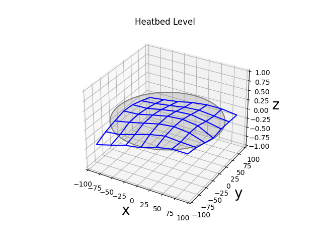
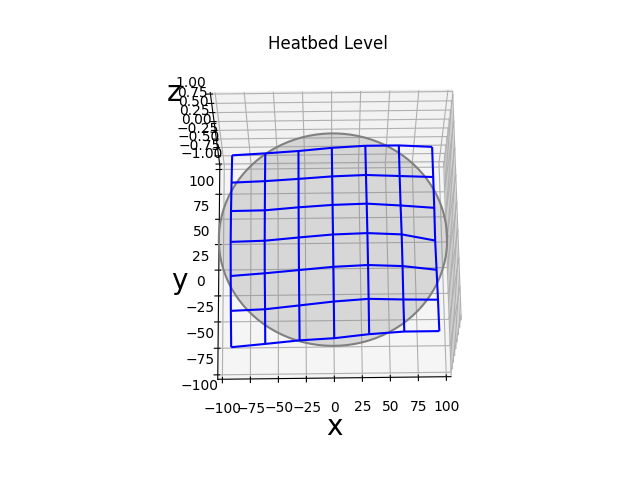
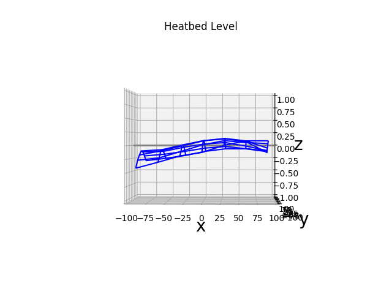
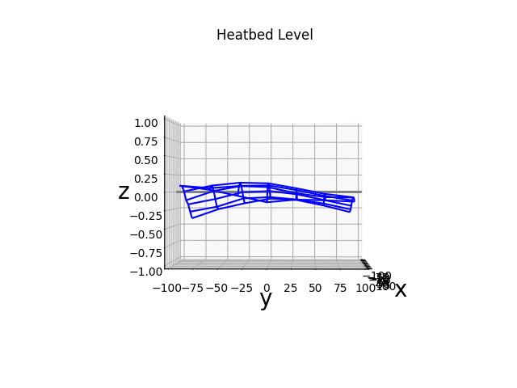

# **Heatbed Level Visualizer**

<br>

## How to

- install/upgrade matplotlib, regex and numpy  
(in some cases wheel has to be installed manually)
```
(pip install --upgrade pip setuptools wheel)
pip install --upgrade matplotlib
pip install regex
pip install numpy
```

- retrieve the stored mesh/matrix data (for example with octoprint terminal)  
```
M420 V
```
- copy and paste mesh/matrix data to raw variable in this program (carefully keep the formatting)
- set variables for bedform, bedsize, inset, zrange for your heatbed
- execute program

<br>
<br>

## Example





<br>
<br>

----------

[qrt@qland.de](mailto:qrt@qland.de) 201016
